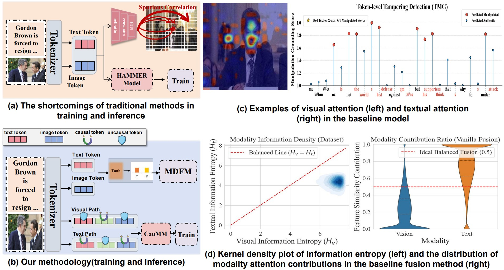
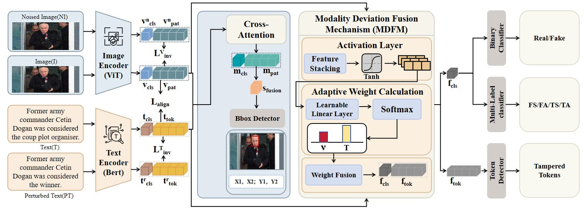

# Causal Invariant Representation Learning for Detecting and Localizing Multimodal Media Manipulation



The official repo for **CauMM**, a Causal Invariant Representation Learning framework for Detecting and Localizing Multimodal Media Manipulation.
Full paper can be found at: [arXiv:xxxx.xxxxx](https://arxiv.org/pdf/xxxx).

<div style='display:flex; gap: 0.25rem; '>
<a href='https://arxiv.org/pdf/xxxx'></a>
<a href='LICENSE'></a>
</div>

## 🗓 To-Do List
- ✅ Key code for editing attention released
- ✅ Preprint of the paper released, check it [here](https://arxiv.org/pdf/xxxx)
- ⭕ English version of the introduction video
- ⭕ The video talk (Chinese version) is now public
- ⭕ Full code release

## 📖 Introduction
This repository introduces **CauMM** (Causal MultiModal), a novel causal invariant multimodal deepfake detection framework. It aims to fundamentally resolve two structural pathologies in existing methodologies: the vulnerability to spurious correlations with unmanipulated backgrounds, and the paradoxical "text-dominant" shortcut learning during cross-modal fusion. 

Grounded in a rigorous Structural Causal Model (SCM), CauMM innovatively employs a Global Noise Injection Module (GNIM) and a Semantic Consistency Perturber (SCP) to perform dual-modal causal interventions. By synthesizing counterfactual environments, it explicitly severs non-causal dependencies, thereby guaranteeing prediction invariance against background perturbations. Furthermore, the core Modality Deviation Fusion Mechanism (MDFM) utilizes instance-level adaptive weight calibration to dynamically balance visual and textual features. This systematically breaks the lazy text-dominant loop, forcing the network to confront and exploit dense, hard-to-learn visual tampering traces. 

Extensive experiments demonstrate that CauMM establishes a new state-of-the-art (SOTA) across all four subtasks (binary detection, multi-label classification, image grounding, and text grounding) on the large-scale DGM$^4$ benchmark, exhibiting exceptional detection robustness, generalizability, and theoretical interpretability.

**The framework of the proposed CauMM model:**



## 🛠️ Environment Setup

**1. Clone the repository:**
```bash
mkdir code
cd code
git clone [https://github.com/zxy322/CauMM.git](https://github.com/zxy322/CauMM.git)
cd CauMM
```

**2. Create a conda environment and install dependencies:**
```
conda create -n CauMM python=3.8
conda activate CauMM
conda install --yes -c pytorch pytorch=1.10.0 torchvision==0.11.1 cudatoolkit=11.3
pip install -r requirements.txt
```

## 📝 Citation
Welcome to star our repo and cite our work:
```
@article{CauMM2026,
  title={Causal Invariant Representation Learning for Detecting and Localizing Multimodal Media Manipulation},
  author={Your Name and Co-author1 and Co-author2},
  journal={arXiv preprint arXiv:xxxx.xxxxx},
  year={2026}
}
```

## 🙏 Acknowledgement
We sincerely thank the authors of [MultiModal-DeepFake](https://github.com/rshaojimmy/MultiModal-DeepFake) for their excellent work.  
We heavily used the code from their repository in developing this project.
